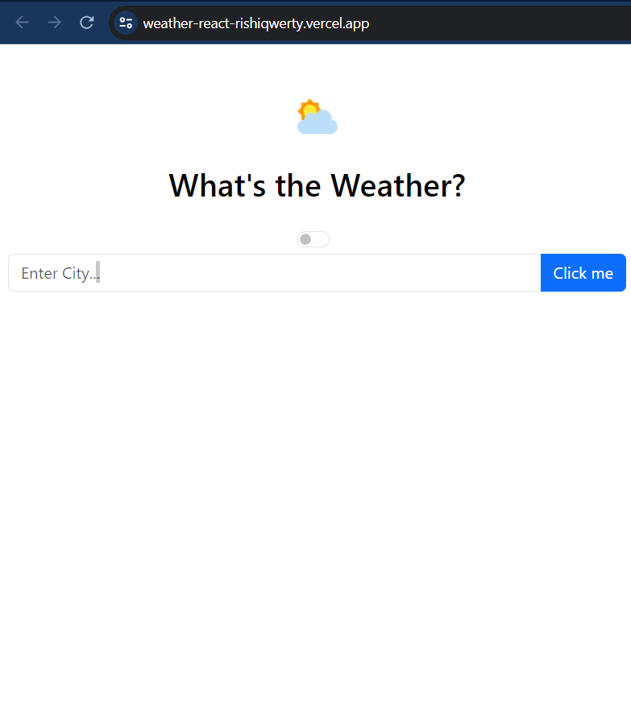
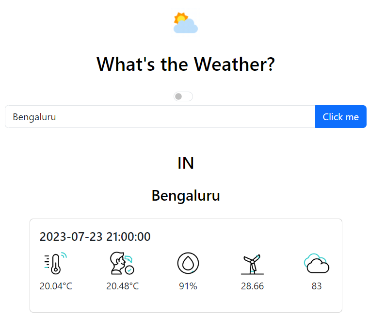

# What's the Weather
A react based Weather which fetches data from **openweathermap** and displays data on 3 hours basis for next 4 days

Link to app: https://weather-react-rishiqwerty.vercel.app/
## Getting Started with Weather React App

In the project directory, you can run:
### `npm i`
### `npm start`

Runs the app in the development mode.\
Open [http://localhost:3000](http://localhost:3000) to view it in your browser.

The page will reload when you make changes.\
You may also see any lint errors in the console.

### `npm run build`

Builds the app for production to the `build` folder.\
It correctly bundles React in production mode and optimizes the build for the best performance.

### Some screenshots from the app:

